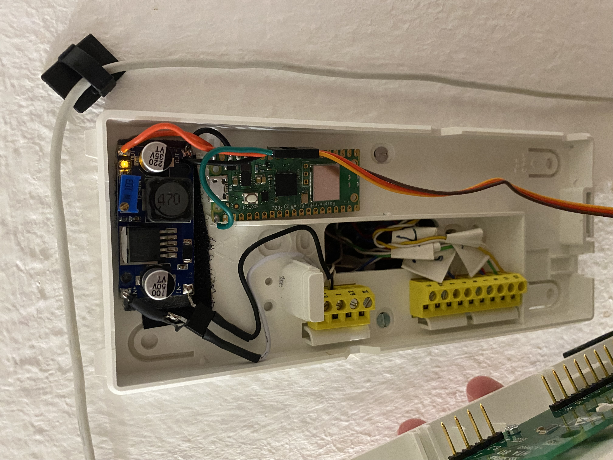

# Intercom Switcher

Remotely-controlled intercom switcher based on a Raspberry Pi Pico and a SG90 servo motor.

**WARNING:** Do not open your intercom and fiddle around if you don't know what you are doing, even small AC voltages
may be dangerous or even fatal. Proceed (or better - don't) on your own risk.

## Power Supply

The `HTA-811` intercom I have provides ~12V AC on the door opener terminal. Using a bridge rectifier with a step-down
converter can provide the RPi Pico with enough power:

**NOTE:** The hijacked power supply is not stable enough and results in frequent reboots during the busy hours. So I
recommend using a dedicated power supply instead.

### Servo

Depending on the target state, the servo power consumption might spike dramatically, to avoid that, the switcher first
slowly swipes through all the possible positions and then settles in the middle. When turning the intercom on/off,
the desired position is not set directly, but instead slowly changed from the current position.

## UI

If there is no configuration present, the board will spin up an access point called `RpiIntercom`, see
[wifi.py](./wifi.py) for details. After connecting to it you should be able to configure a network to connect to.

## API

See the [server.py](./server.py) file for a list of possible POST commands, and the
[scheduler](./doc/scheduler/scheduler) file, for an automation example.

## Mount

See [prints](./doc/prints) contents for the mount and the servo knob FreeCAD models.

## References

- [SSS Siedle HTA 811 - Door Phone - Notify in Ring](https://community.home-assistant.io/t/sss-siedle-hta-811-door-phone-notify-in-ring/405179)
- [Smarte Türklingel – Alte Sprechanlage smart machen](https://www.panbachi.de/smarte-tuerklingel-alte-sprechanlage-smart-machen/)